# Russian OCR Benchmark

Бенчмарк OCR для современного и исторического русского текста. Версия **v1**, дата фиксации — **4 октября 2026 года**.

Инструкция по полному воспроизведению окружений, загрузке моделей и датасетов, запуску задач и пересборке таблиц: [REPRODUCING.md](REPRODUCING.md).

Протестировано **40 модели/конфигурации** на **13 наборах данных** в четырёх задачах: детекция слов, детекция строк, распознавание слов и распознавание строк.

## Модели

| Модель | Источник | Лицензия |
| --- | --- | --- |
| `east_50_g1` | [source](https://github.com/konstantinkozhin/manuscript-ocr) | MIT |
| `yolo26s_obb_text_g1` | [source](https://github.com/konstantinkozhin/manuscript-ocr) | AGPL-3.0 |
| `yolo26x_obb_text_g1` | [source](https://github.com/konstantinkozhin/manuscript-ocr) | AGPL-3.0 |
| `yolo11n_text` | [source](https://huggingface.co/RoyRud1902/yolo11n-text) | Apache-2.0 |
| `yolo11x_dialectic` | [source](https://huggingface.co/Daniil-Domino/yolo11x-dialectic) | AGPL-3.0 |
| `craft_easyocr` | [source](https://github.com/JaidedAI/EasyOCR) | Apache-2.0 |
| `paddleocr_v6_medium_word` | [source](https://www.paddleocr.ai/latest/en/version3.x/algorithm/PP-OCRv6/PP-OCRv6.html) | Apache-2.0 |
| `doctr_db_resnet50` | [source](https://github.com/mindee/doctr) | Apache-2.0 |
| `openocr_repvit_db` | [source](https://github.com/Topdu/OpenOCR) | Apache-2.0 |
| `paddleocr_v6_medium_line` | [source](https://www.paddleocr.ai/latest/en/version3.x/algorithm/PP-OCRv6/PP-OCRv6.html) | Apache-2.0 |
| `rfdetr_textline_textregion_2xl` | [source](https://huggingface.co/Kansallisarkisto/rfdetr-textline-textregion-detection-2xl) | Apache-2.0 |
| `rfdetr_textline_textregion_seg_preview` | [source](https://huggingface.co/Kansallisarkisto/rfdetr_textline_textregion_detection_model) | Apache-2.0 |
| `court_records_textline_yolov8x_seg` | [source](https://huggingface.co/Kansallisarkisto/court-records-textline-detection) | AGPL-3.0 |
| `mask2former_line_v0_prev` | [source](https://github.com/konstantinkozhin/manuscript-ocr) | CC-BY-NC-3.0 |
| `doc_ufcn_generic_historical_line` | [source](https://huggingface.co/Teklia/doc-ufcn-generic-historical-line) | MIT |
| `surya_text_line_detection` | [source](https://github.com/datalab-to/surya) | Apache-2.0 |
| `kraken_blla_default` | [source](https://github.com/mittagessen/kraken) | Apache-2.0 |
| `pero_layout_general` | [source](https://github.com/DCGM/pero-ocr) | BSD-3-Clause |
| `riksarkivet_rtmdet_lines` | [source](https://huggingface.co/Riksarkivet/rtmdet_lines) | MIT |
| `trba_lite_g1` | [source](https://github.com/konstantinkozhin/manuscript-ocr) | MIT |
| `trba_base_g1` | [source](https://github.com/konstantinkozhin/manuscript-ocr) | MIT |
| `cyrillic_g1` | [source](https://github.com/JaidedAI/EasyOCR) | Apache-2.0 |
| `cyrillic_g2` | [source](https://github.com/JaidedAI/EasyOCR) | Apache-2.0 |
| `paddleocr_cyrillic_v5_mobile` | [source](https://huggingface.co/PaddlePaddle/cyrillic_PP-OCRv5_mobile_rec) | Apache-2.0 |
| `paddleocr_eslav_v5_mobile` | [source](https://huggingface.co/PaddlePaddle/eslav_PP-OCRv5_mobile_rec) | Apache-2.0 |
| `trocr_ru_1700s` | [source](https://huggingface.co/taiga75/ru-trocr-1700s) | MIT |
| `trocr_prereform_orthography` | [source](https://huggingface.co/Serovvans/trocr-prereform-orthography) | OpenRAIL |
| `trocr_dialectic_stackmix` | [source](https://huggingface.co/Daniil-Domino/trocr-base-ru-dialectic-stackmix) | Apache-2.0 |
| `trocr_dialectic` | [source](https://huggingface.co/Daniil-Domino/trocr-base-ru-dialectic) | Apache-2.0 |
| `trocr_base_ru` | [source](https://huggingface.co/raxtemur/trocr-base-ru) | Apache-2.0 |
| `trocr_base_handwritten_ru` | [source](https://huggingface.co/kazars24/trocr-base-handwritten-ru) | Не указана |
| `cyrillic_htr_model` | [source](https://huggingface.co/Kansallisarkisto/cyrillic-htr-model) | Apache-2.0 |
| `cyrillic_large_handwritten` | [source](https://huggingface.co/Kansallisarkisto/cyrillic-large-handwritten) | Apache-2.0 |
| `crnn_ctc_church_slavonic` | [source](https://huggingface.co/achimrabus/crnn-ctc-church-slavonic) | Apache-2.0 |
| `turkicocr_svtrv2_b` | [source](https://huggingface.co/alenisaw/turkicocr-svtrv2-b) | Apache-2.0 |
| `kraken_ppocrv6_medium` | [source](https://zenodo.org/records/21788410) | Apache-2.0 |
| `kraken_ppocrv6_small` | [source](https://zenodo.org/records/21788405) | Apache-2.0 |
| `kraken_ppocrv6_tiny` | [source](https://zenodo.org/records/21788403) | Apache-2.0 |
| `tesseract_rus_best` | [source](https://github.com/tesseract-ocr/tessdata_best/blob/main/rus.traineddata) | Apache-2.0 |
| `tesseract_cyrillic_best` | [source](https://github.com/tesseract-ocr/tessdata_best/blob/main/script/Cyrillic.traineddata) | Apache-2.0 |

Лицензии взяты из карточек моделей или исходных репозиториев.

## Датасеты

| Датасет | Источник | Лицензия | Использованное подмножество | Объём в бенчмарке |
| --- | --- | --- | --- | --- |
| `russian_old_orthography` | [source](https://huggingface.co/datasets/nevmenandr/russian-old-orthography-ocr) | MIT | А. В. Зражевская — «Женщина — поэт и автор»; все 39 страниц книги | детекция слов/строк — 39 страниц; распознавание — 8 489 слов и 1 406 строк |
| `YeniseiGovReports-TD` | [source](https://huggingface.co/datasets/anna4uonline/YeniseiGovReports-TD) | MIT | test | 270 изображений (детекция слов) |
| `school_notebooks_RU` | [source](https://huggingface.co/datasets/ai-forever/school_notebooks_RU) | MIT | validation | 150 страниц; 27 893 слова; 6 453 строки |
| `handwritten_essay` | [source](https://huggingface.co/datasets/sherstpasha/handwritten_essay) | CC-BY-NC-3.0 | валидационная часть из каталога `train/` | 28 страниц; 5 146 слов; 676 строк |
| `ICDAR2015` | [source](https://rrc.cvc.uab.es/?ch=4) | Условия ICDAR/RRC | test | 200 изображений (детекция слов) |
| `TotalText` | [source](https://github.com/cs-chan/Total-Text-Dataset) | BSD-3-Clause | test | 300 изображений (детекция слов) |
| `gota_hovratt_seg` | [source](https://huggingface.co/datasets/Riksarkivet/gota_hovratt_seg) | Не указана | все доступные пары изображение + PAGE XML | 51 изображение (детекция строк) |
| `svea_hovratt_seg` | [source](https://huggingface.co/datasets/Riksarkivet/svea_hovratt_seg) | Не указана | первые 100 PAGE XML в лексикографическом порядке | 100 изображений (детекция строк) |
| `bergskollegium_relationer_och_skrivelser_seg` | [source](https://huggingface.co/datasets/Riksarkivet/bergskollegium_relationer_och_skrivelser_seg) | Не указана | первые 100 PAGE XML в лексикографическом порядке | 100 изображений (детекция строк) |
| `YeniseiGovReports-HWR` | [source](https://huggingface.co/datasets/sherstpasha/YeniseiGovReports-HWR) | MIT | val | 22 400 слов |
| `YeniseiGovReports-PRT` | [source](https://huggingface.co/datasets/sherstpasha/YeniseiGovReports-PRT) | MIT | val | 15 394 слова |
| `cyrillic_handwriting` | [source](https://www.kaggle.com/datasets/constantinwerner/cyrillic-handwriting-dataset) | CC0-1.0 | test | 1 544 слова |
| `DonkeySmallOCR-Numbers-Printed-15random` | [source](https://huggingface.co/datasets/sherstpasha/DonkeySmallOCR-Numbers-Printed-15random) | Не указана | val | 1 500 слов |

Лицензии взяты из карточек датасетов или исходных репозиториев.

## Результаты детекции слов

Метрики в ячейке: `F1@0.5 / F1@0.5:0.95 / Dice F1 / Polygon H-mean@0.5`; для всех метрик больше — лучше.

`Mean Metric Rank`: 1 — лучший средний ранг; меньше — лучше.

| Model | Origin | Mean F1@0.5 | Mean F1@0.5:0.95 | Mean Dice F1 | Mean Polygon H-mean@0.5 | Mean Metric Rank | [russian_old_orthography](https://huggingface.co/datasets/nevmenandr/russian-old-orthography-ocr) | [YeniseiGovReports-TD](https://huggingface.co/datasets/anna4uonline/YeniseiGovReports-TD) | [school_notebooks_RU](https://huggingface.co/datasets/ai-forever/school_notebooks_RU) | [handwritten_essay](https://huggingface.co/datasets/sherstpasha/handwritten_essay) | [ICDAR2015](https://rrc.cvc.uab.es/?ch=4) | [TotalText](https://github.com/cs-chan/Total-Text-Dataset) | Mean GPU FPS |
| --- | --- | --- | --- | --- | --- | --- | --- | --- | --- | --- | --- | --- | --- |
| yolo26x_obb_text_g1 | [source](https://github.com/konstantinkozhin/manuscript-ocr) | **0.85** | **0.62** | **0.79** | **0.75** | **1.00** | 0.93 / 0.69 / 0.88 / **0.93** | 0.90 / **0.72** / 0.92 / 0.90 | **0.97** / 0.80 / **0.79** / **0.80** | 0.89 / 0.62 / 0.92 / 0.90 | **0.65** / **0.43** / **0.66** / **0.50** | **0.74** / 0.46 / 0.54 / 0.46 | 7.57 |
| yolo26s_obb_text_g1 | [source](https://github.com/konstantinkozhin/manuscript-ocr) | 0.84 | 0.61 | 0.78 | 0.74 | 2.00 | **0.93** / **0.69** / **0.88** / 0.93 | 0.90 / 0.72 / **0.92** / 0.90 | 0.97 / **0.80** / 0.79 / 0.79 | 0.91 / 0.64 / 0.92 / 0.91 | 0.59 / 0.37 / 0.63 / 0.45 | 0.72 / 0.43 / 0.53 / 0.44 | 10.85 |
| east_50_g1 | [source](https://github.com/konstantinkozhin/manuscript-ocr) | 0.76 | 0.48 | 0.76 | 0.73 | 3.50 | 0.92 / 0.58 / 0.85 / 0.92 | **0.90** / 0.61 / 0.88 / **0.91** | 0.92 / 0.58 / 0.77 / 0.77 | **0.93** / 0.65 / 0.91 / **0.93** | 0.54 / 0.28 / 0.60 / 0.45 | 0.37 / 0.16 / 0.55 / 0.38 | 7.86 |
| yolo11n_text | [source](https://huggingface.co/RoyRud1902/yolo11n-text) | 0.74 | 0.48 | 0.77 | 0.69 | 3.50 | 0.90 / 0.54 / 0.83 / 0.90 | 0.70 / 0.41 / 0.78 / 0.71 | 0.77 / 0.45 / 0.79 / 0.66 | 0.85 / **0.66** / **0.93** / 0.85 | 0.53 / 0.34 / 0.63 / 0.46 | 0.70 / **0.48** / **0.64** / **0.55** | **45.48** |
| doctr_db_resnet50 | [source](https://github.com/mindee/doctr) | 0.64 | 0.32 | 0.69 | 0.56 | 5.50 | 0.88 / 0.48 / 0.82 / 0.90 | 0.66 / 0.30 / 0.74 / 0.67 | 0.65 / 0.32 / 0.69 / 0.38 | 0.75 / 0.33 / 0.85 / 0.75 | 0.42 / 0.23 / 0.55 / 0.33 | 0.46 / 0.25 / 0.46 / 0.33 | 5.64 |
| craft_easyocr | [source](https://github.com/JaidedAI/EasyOCR) | 0.62 | 0.32 | 0.73 | 0.51 | 5.50 | 0.72 / 0.33 / 0.77 / 0.72 | 0.62 / 0.32 / 0.81 / 0.63 | 0.61 / 0.34 / 0.74 / 0.44 | 0.74 / 0.45 / 0.90 / 0.74 | 0.40 / 0.21 / 0.63 / 0.25 | 0.61 / 0.29 / 0.55 / 0.30 | 7.55 |
| yolo11x_dialectic | [source](https://huggingface.co/Daniil-Domino/yolo11x-dialectic) | 0.51 | 0.31 | 0.62 | 0.48 | 7.25 | 0.80 / 0.41 / 0.79 / 0.81 | 0.43 / 0.23 / 0.64 / 0.44 | 0.76 / 0.47 / 0.77 / 0.64 | 0.75 / 0.55 / 0.89 / 0.75 | 0.10 / 0.05 / 0.29 / 0.07 | 0.22 / 0.13 / 0.33 / 0.17 | 38.14 |
| openocr_repvit_db | [source](https://github.com/Topdu/OpenOCR) | 0.28 | 0.14 | 0.58 | 0.24 | 8.25 | 0.08 / 0.03 / 0.69 / 0.08 | 0.28 / 0.12 / 0.66 / 0.28 | 0.40 / 0.17 / 0.69 / 0.34 | 0.18 / 0.08 / 0.30 / 0.18 | 0.26 / 0.14 / 0.58 / 0.19 | 0.50 / 0.27 / 0.53 / 0.33 | 24.13 |
| paddleocr_v6_medium_word | [source](https://www.paddleocr.ai/latest/en/version3.x/algorithm/PP-OCRv6/PP-OCRv6.html) | 0.19 | 0.06 | 0.62 | 0.17 | 8.50 | 0.02 / 0.01 / 0.72 / 0.02 | 0.18 / 0.06 / 0.65 / 0.19 | 0.14 / 0.04 / 0.62 / 0.09 | 0.24 / 0.07 / 0.78 / 0.24 | 0.23 / 0.07 / 0.51 / 0.22 | 0.33 / 0.12 / 0.43 / 0.28 | 9.59 |

### Примеры предсказаний

Зелёным показана эталонная разметка, красным — предсказания модели.

| Модель | [**Russian Old Orthography OCR**](https://huggingface.co/datasets/nevmenandr/russian-old-orthography-ocr) `page_007.jpg` | [**Handwritten Essay**](https://huggingface.co/datasets/sherstpasha/handwritten_essay) `test_10_0.png` | [**Total-Text**](https://github.com/cs-chan/Total-Text-Dataset) `img632.jpg` |
| --- | --- | --- | --- |
| **yolo26x_obb_text_g1** | 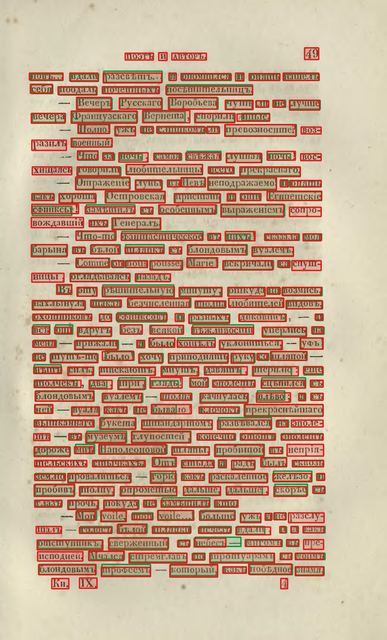 | 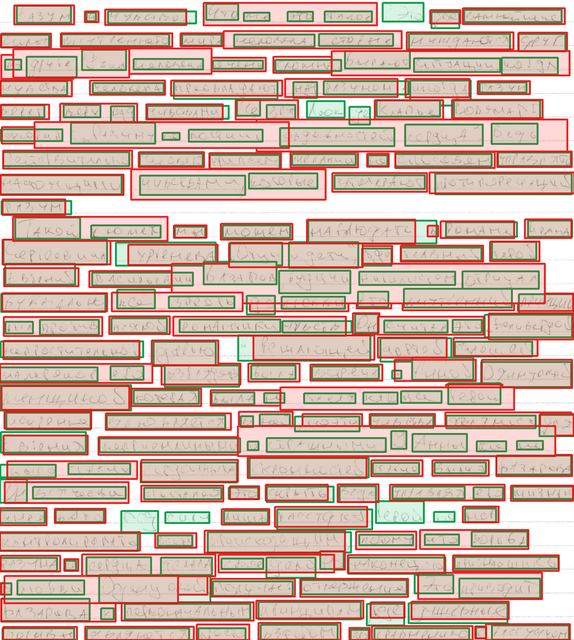 |  |
| **yolo26s_obb_text_g1** | 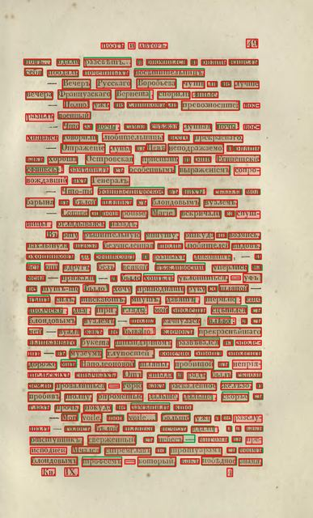 | 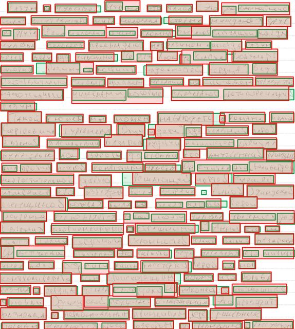 | 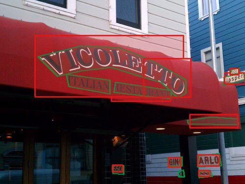 |
| **east_50_g1** | 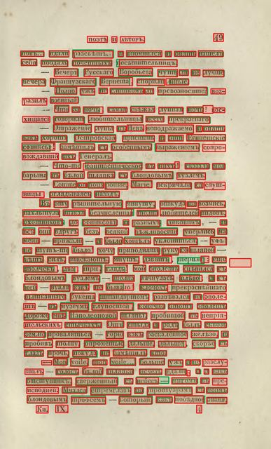 | 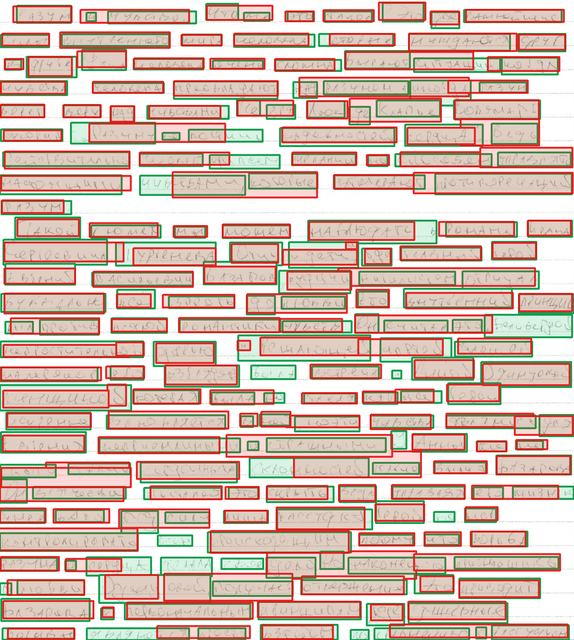 |  |
| **yolo11n_text** | 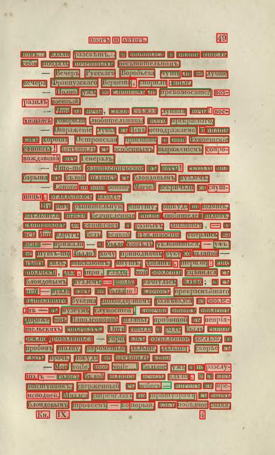 | 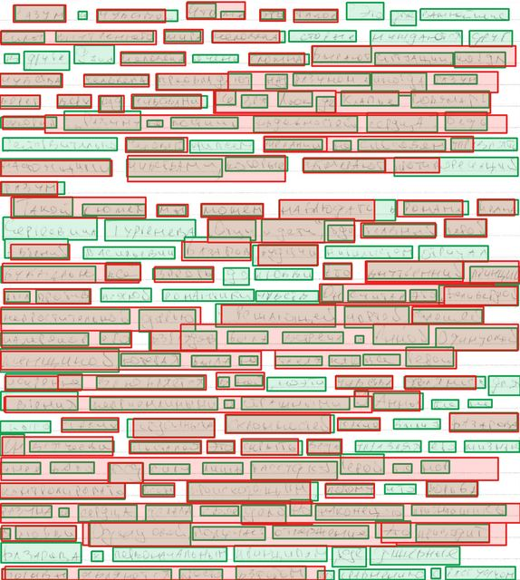 | 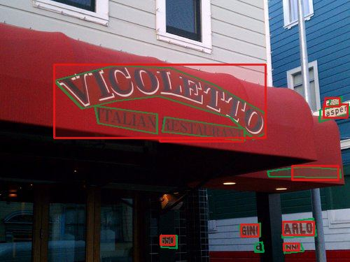 |
| **doctr_db_resnet50** | 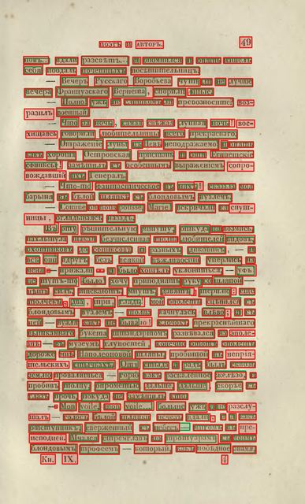 | 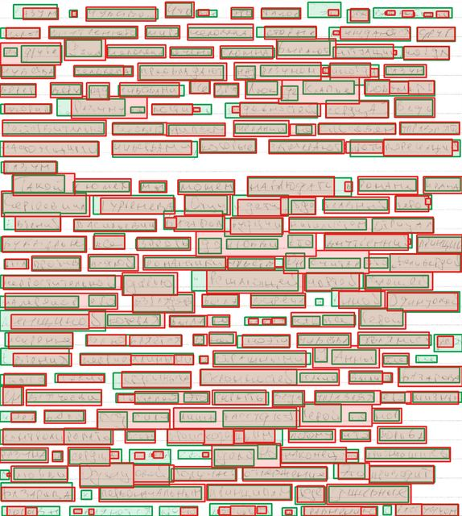 |  |
| **craft_easyocr** | 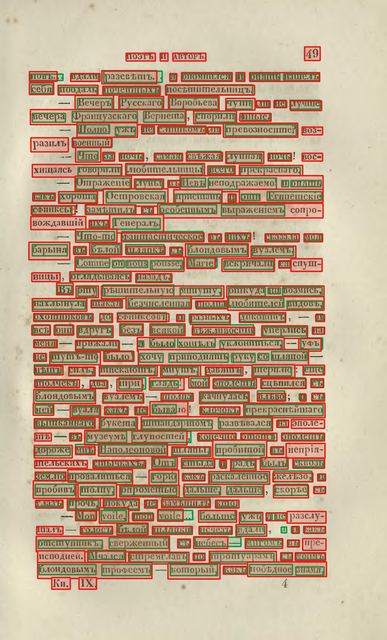 | 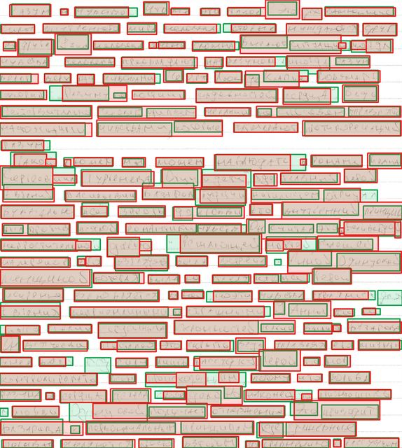 | 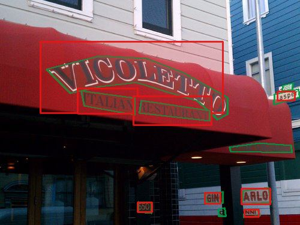 |
| **yolo11x_dialectic** | 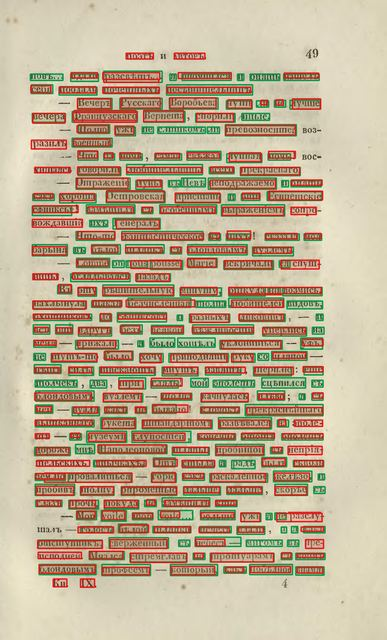 | 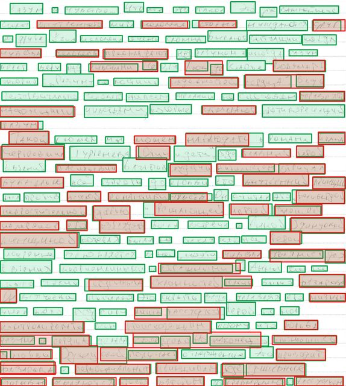 | 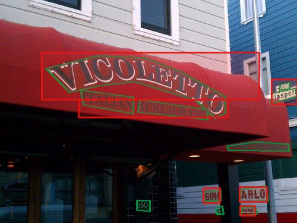 |
| **openocr_repvit_db** | 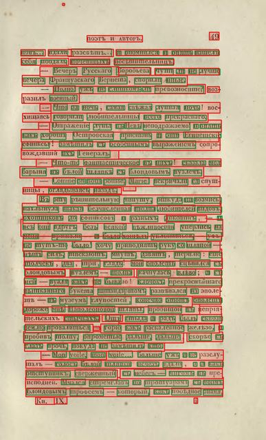 | 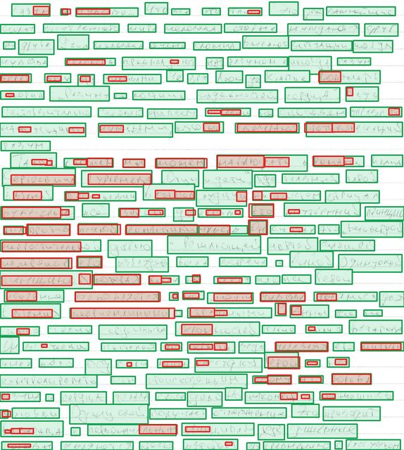 |  |
| **paddleocr_v6_medium_word** | 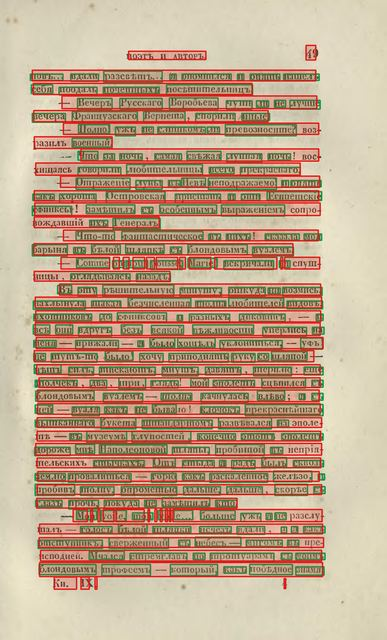 | 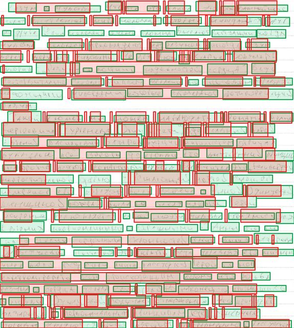 | 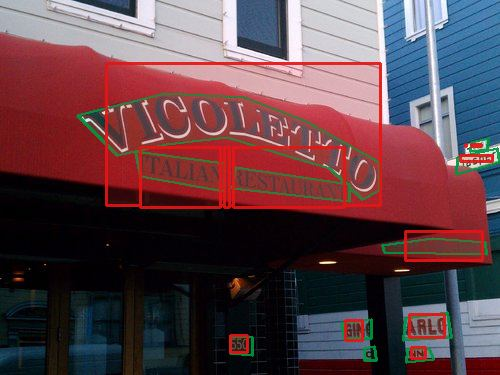 |

## Результаты детекции строк

Метрики в ячейке: `F1@0.5 / F1@0.5:0.95 / Dice F1 / Polygon H-mean@0.5`; для всех метрик больше — лучше.

`Mean Metric Rank`: 1 — лучший средний ранг; меньше — лучше.

| Model | Origin | Mean F1@0.5 | Mean F1@0.5:0.95 | Mean Dice F1 | Mean Polygon H-mean@0.5 | Mean Metric Rank | [russian_old_orthography](https://huggingface.co/datasets/nevmenandr/russian-old-orthography-ocr) | [handwritten_essay](https://huggingface.co/datasets/sherstpasha/handwritten_essay) | [school_notebooks_ru](https://huggingface.co/datasets/ai-forever/school_notebooks_RU) | [gota_hovratt_seg](https://huggingface.co/datasets/Riksarkivet/gota_hovratt_seg) | [svea_hovratt_seg](https://huggingface.co/datasets/Riksarkivet/svea_hovratt_seg) | [bergskollegium_relationer_och_skrivelser_seg](https://huggingface.co/datasets/Riksarkivet/bergskollegium_relationer_och_skrivelser_seg) | Mean GPU FPS |
| --- | --- | --- | --- | --- | --- | --- | --- | --- | --- | --- | --- | --- | --- |
| rfdetr_textline_textregion_seg_preview | [source](https://huggingface.co/Kansallisarkisto/rfdetr_textline_textregion_detection_model) | 0.96 | 0.69 | **0.91** | 0.83 | **2.75** | 0.96 / 0.56 / 0.90 / 0.97 | 0.96 / 0.70 / 0.94 / 0.96 | 0.88 / 0.57 / 0.92 / 0.85 | 0.97 / 0.79 / 0.91 / 0.69 | 0.98 / 0.78 / 0.89 / 0.72 | 0.98 / 0.73 / 0.90 / 0.80 | 8.50 |
| rfdetr_textline_textregion_2xl | [source](https://huggingface.co/Kansallisarkisto/rfdetr-textline-textregion-detection-2xl) | **0.96** | **0.71** | 0.91 | 0.82 | 3.00 | 0.95 / 0.45 / 0.89 / 0.95 | 0.98 / 0.77 / 0.95 / 0.98 | 0.90 / 0.62 / 0.91 / 0.83 | 0.98 / 0.85 / 0.91 / 0.64 | 0.99 / 0.83 / 0.89 / 0.76 | 0.98 / 0.77 / 0.89 / 0.77 | 8.43 |
| mask2former_line_v0_prev | [source](https://github.com/konstantinkozhin/manuscript-ocr) | 0.92 | 0.67 | 0.91 | 0.86 | 3.00 | 0.90 / 0.66 / 0.81 / 0.90 | 1.00 / 0.90 / 0.98 / 1.00 | 0.93 / 0.75 / 0.97 / 0.94 | 0.92 / 0.62 / 0.90 / 0.84 | 0.87 / 0.55 / 0.89 / 0.85 | 0.90 / 0.56 / 0.90 / 0.62 | 0.40 |
| court_records_textline_yolov8x_seg | [source](https://huggingface.co/Kansallisarkisto/court-records-textline-detection) | 0.88 | 0.60 | 0.89 | 0.87 | 3.75 | 0.83 / 0.42 / 0.86 / 0.83 | 0.76 / 0.52 / 0.91 / 0.73 | 0.85 / 0.61 / 0.91 / 0.83 | 0.97 / 0.69 / 0.90 / 0.96 | 0.95 / 0.67 / 0.88 / 0.94 | 0.94 / 0.69 / 0.90 / 0.94 | 6.28 |
| kraken_blla_default | [source](https://github.com/mittagessen/kraken) | 0.92 | 0.50 | 0.87 | **0.92** | 4.50 | 0.93 / 0.43 / 0.90 / 0.96 | 0.95 / 0.64 / 0.87 / 0.93 | 0.80 / 0.49 / 0.86 / 0.78 | 0.94 / 0.48 / 0.86 / 0.94 | 0.92 / 0.49 / 0.87 / 0.92 | 0.97 / 0.46 / 0.87 / 0.98 | 0.12 |
| paddleocr_v6_medium_line | [source](https://www.paddleocr.ai/latest/en/version3.x/algorithm/PP-OCRv6/PP-OCRv6.html) | 0.88 | 0.56 | 0.88 | 0.86 | 4.75 | 0.97 / 0.66 / 0.90 / 0.97 | 0.81 / 0.53 / 0.95 / 0.82 | 0.82 / 0.54 / 0.86 / 0.81 | 0.89 / 0.58 / 0.87 / 0.88 | 0.88 / 0.53 / 0.87 / 0.84 | 0.90 / 0.54 / 0.85 / 0.84 | 3.69 |
| riksarkivet_rtmdet_lines | [source](https://huggingface.co/Riksarkivet/rtmdet_lines) | 0.82 | 0.47 | 0.82 | 0.85 | 7.00 | 0.76 / 0.56 / 0.74 / 0.76 | 0.87 / 0.50 / 0.86 / 0.86 | 0.81 / 0.48 / 0.84 / 0.79 | 0.80 / 0.34 / 0.81 / 0.90 | 0.73 / 0.31 / 0.77 / 0.82 | 0.96 / 0.63 / 0.90 / 0.96 | 2.22 |
| surya_text_line_detection | [source](https://github.com/datalab-to/surya) | 0.75 | 0.35 | 0.88 | 0.75 | 7.75 | 0.91 / 0.52 / 0.88 / 0.92 | 0.95 / 0.53 / 0.92 / 0.94 | 0.72 / 0.38 / 0.89 / 0.71 | 0.76 / 0.31 / 0.88 / 0.75 | 0.36 / 0.13 / 0.85 / 0.38 | 0.80 / 0.25 / 0.87 / 0.80 | 2.99 |
| pero_layout_general | [source](https://github.com/DCGM/pero-ocr) | 0.74 | 0.37 | 0.85 | 0.74 | 8.50 | 0.97 / 0.67 / 0.90 / 0.97 | 0.77 / 0.30 / 0.83 / 0.76 | 0.56 / 0.27 / 0.83 / 0.54 | 0.79 / 0.36 / 0.87 / 0.82 | 0.56 / 0.20 / 0.80 / 0.59 | 0.80 / 0.41 / 0.88 / 0.78 | 5.19 |
| doc_ufcn_generic_historical_line | [source](https://huggingface.co/Teklia/doc-ufcn-generic-historical-line) | 0.27 | 0.10 | 0.60 | 0.22 | 10.00 | 0.85 / 0.42 / 0.72 / 0.57 | 0.10 / 0.02 / 0.49 / 0.01 | 0.33 / 0.09 / 0.58 / 0.10 | 0.19 / 0.04 / 0.62 / 0.20 | 0.08 / 0.01 / 0.54 / 0.05 | 0.08 / 0.01 / 0.66 / 0.36 | 4.68 |

### Примеры предсказаний

Зелёным показана эталонная разметка, красным — предсказания модели.

| Модель | [**Russian Old Orthography OCR**](https://huggingface.co/datasets/nevmenandr/russian-old-orthography-ocr) `page_007.jpg` | [**School Notebooks RU**](https://huggingface.co/datasets/ai-forever/school_notebooks_RU) `2647.jpg` | [**Göta Hovrätt Segmentation**](https://huggingface.co/datasets/Riksarkivet/gota_hovratt_seg) `image_00026.jpg` |
| --- | --- | --- | --- |
| **rfdetr_textline_textregion_seg_preview** | 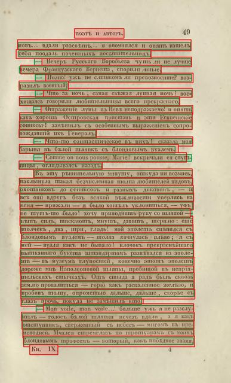 | 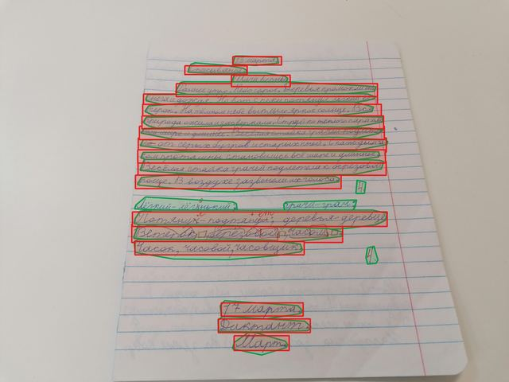 | 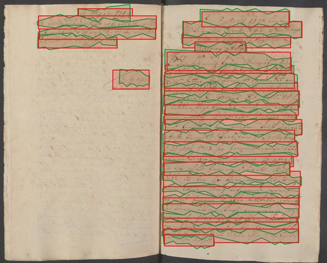 |
| **rfdetr_textline_textregion_2xl** | 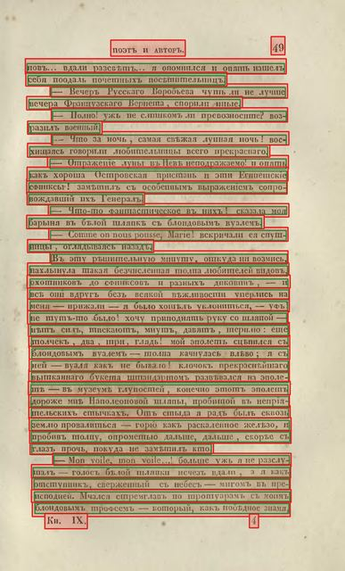 |  | 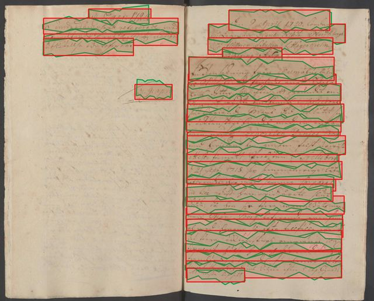 |
| **mask2former_line_v0_prev** | 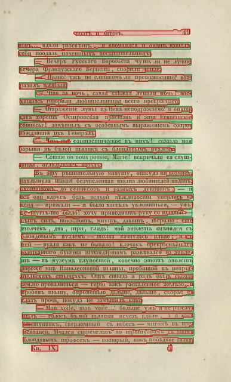 | 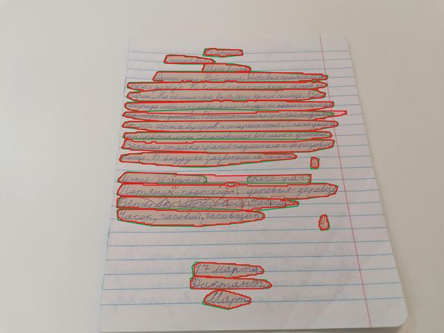 | 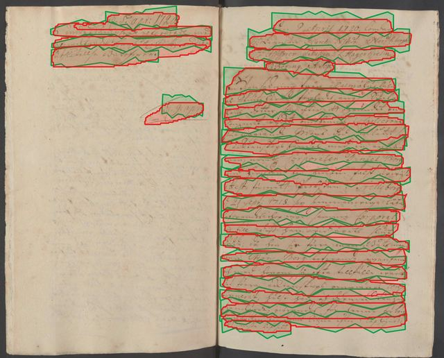 |
| **court_records_textline_yolov8x_seg** | 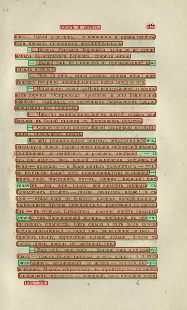 | 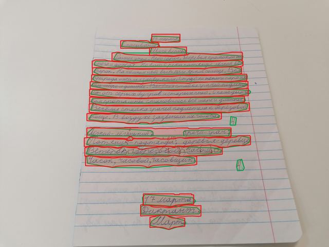 | 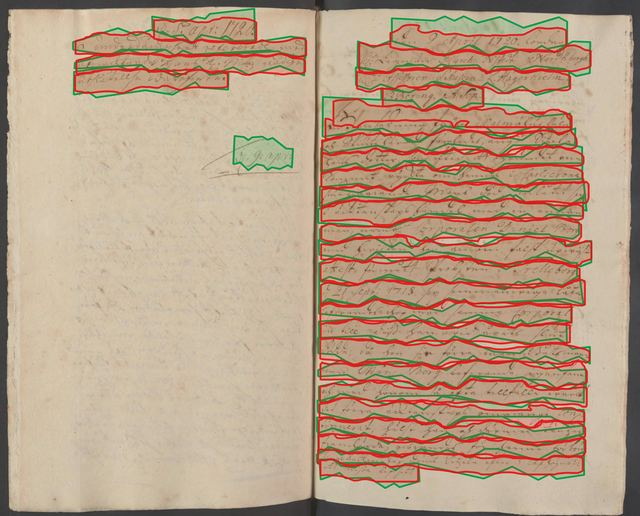 |
| **kraken_blla_default** | 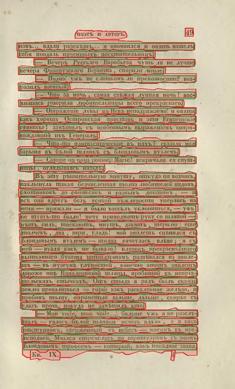 | 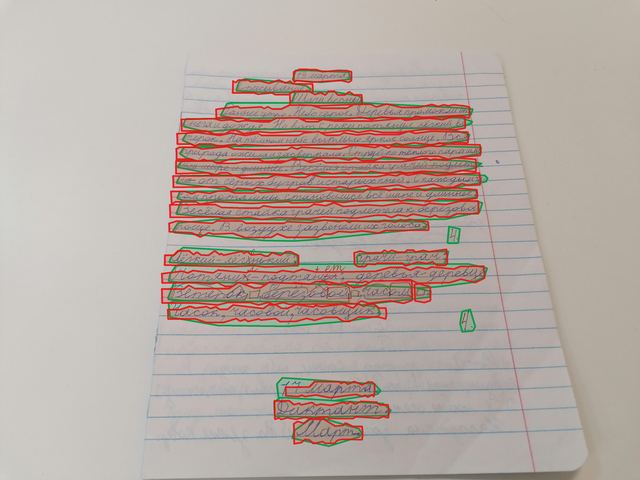 | 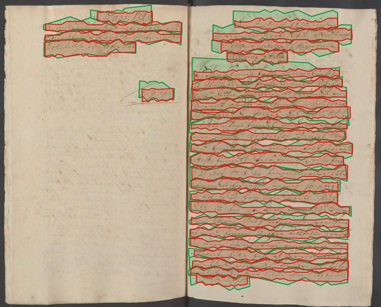 |
| **paddleocr_v6_medium_line** | 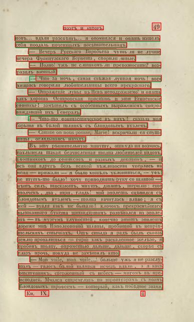 | 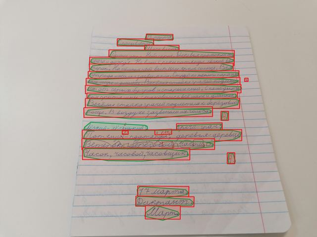 | 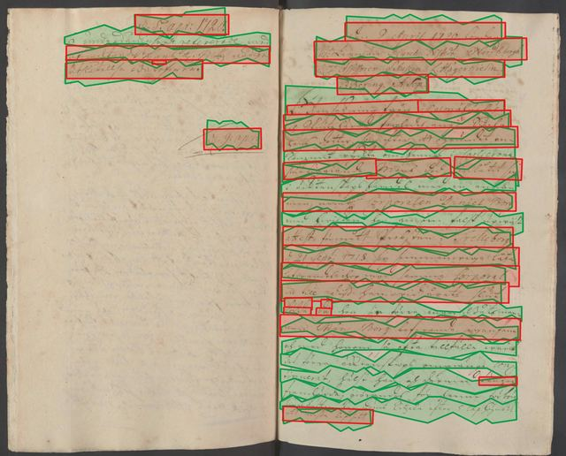 |
| **riksarkivet_rtmdet_lines** | 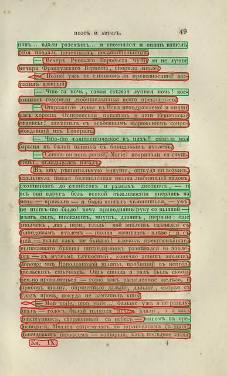 | 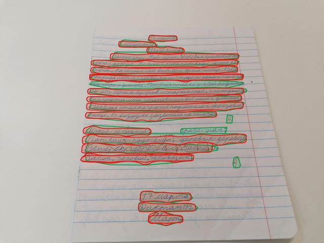 | 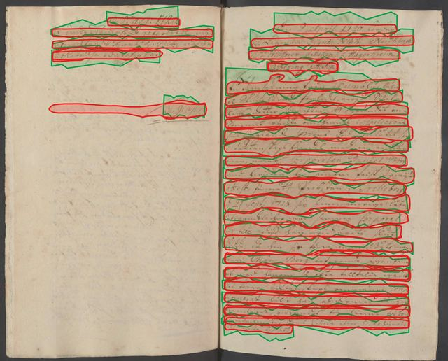 |
| **surya_text_line_detection** | 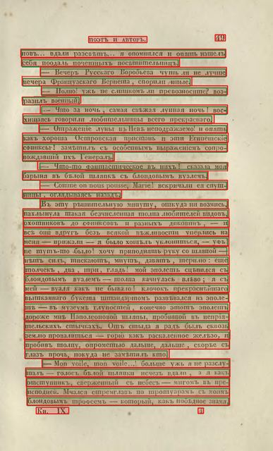 | 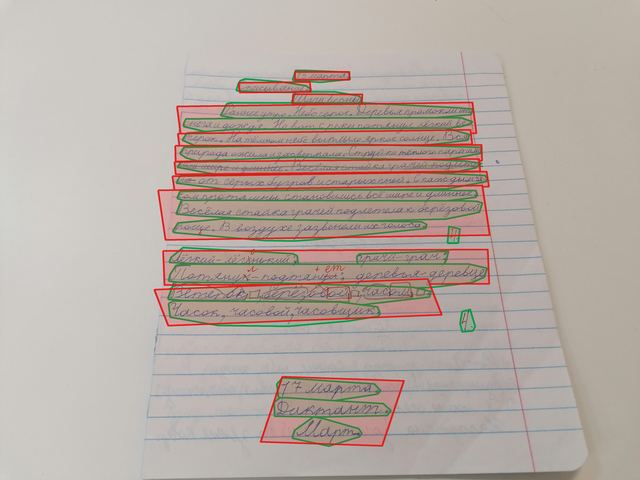 | 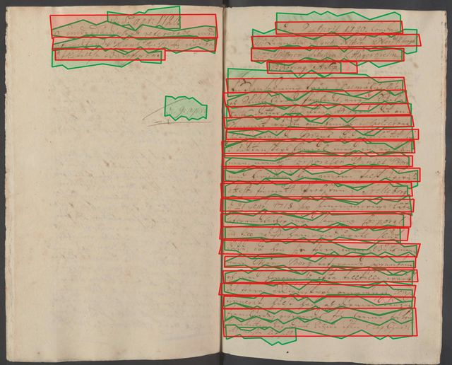 |
| **pero_layout_general** | 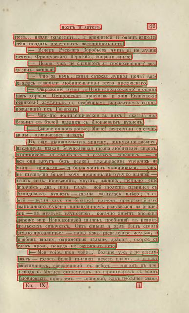 | 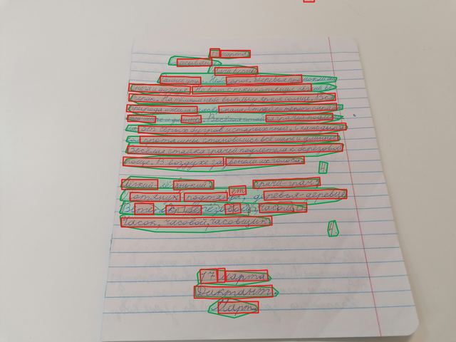 | 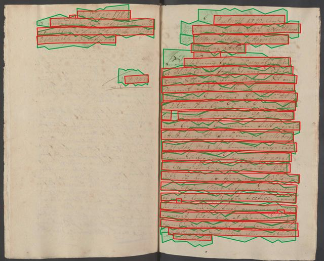 |
| **doc_ufcn_generic_historical_line** | 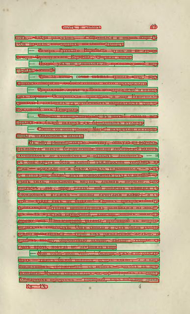 | 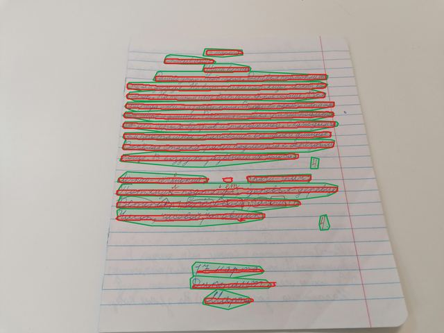 |  |

## Результаты распознавания слов

Метрики в ячейке: `Character Similarity / Exact Match / CER / WER`; для первых двух больше — лучше, для CER и WER меньше — лучше.

`Mean Metric Rank`: 1 — лучший средний ранг; меньше — лучше.

| Model | Origin | Mean Character Similarity | Mean Exact Match | Mean CER | Mean WER | Mean Metric Rank | [russian_old_orthography](https://huggingface.co/datasets/nevmenandr/russian-old-orthography-ocr) | [school_notebooks_ru](https://huggingface.co/datasets/ai-forever/school_notebooks_RU) | [handwritten_essay](https://huggingface.co/datasets/sherstpasha/handwritten_essay) | [yenisei_gov_reports_hwr](https://huggingface.co/datasets/sherstpasha/YeniseiGovReports-HWR) | [yenisei_gov_reports_prt](https://huggingface.co/datasets/sherstpasha/YeniseiGovReports-PRT) | [cyrillic_handwriting](https://www.kaggle.com/datasets/constantinwerner/cyrillic-handwriting-dataset) | [donkeysmall_printed_15random](https://huggingface.co/datasets/sherstpasha/DonkeySmallOCR-Numbers-Printed-15random) | Mean words/s |
| --- | --- | --- | --- | --- | --- | --- | --- | --- | --- | --- | --- | --- | --- | --- |
| trba_base_g1 | [source](https://github.com/konstantinkozhin/manuscript-ocr) | **0.94** | **0.76** | **0.06** | **0.25** | **1.00** | **0.94** / 0.78 / **0.06** / 0.23 | 0.94 / 0.80 / **0.05** / 0.21 | 0.88 / 0.62 / 0.12 / 0.40 | **0.97** / **0.91** / **0.03** / **0.10** | **0.99** / **0.96** / **0.01** / **0.04** | 0.94 / 0.68 / 0.06 / 0.29 | 0.90 / 0.59 / 0.11 / 0.45 | 680.50 |
| trba_lite_g1 | [source](https://github.com/konstantinkozhin/manuscript-ocr) | 0.93 | 0.75 | 0.07 | 0.26 | 2.00 | 0.93 / 0.75 / 0.07 / 0.25 | **0.94** / **0.80** / 0.05 / **0.21** | 0.87 / 0.62 / 0.13 / 0.39 | 0.96 / 0.88 / 0.04 / 0.13 | 0.98 / 0.95 / 0.02 / 0.06 | 0.94 / 0.68 / 0.07 / 0.30 | 0.88 / 0.56 / 0.13 / 0.47 | 237.86 |
| trocr_ru_1700s | [source](https://huggingface.co/taiga75/ru-trocr-1700s) | 0.88 | 0.68 | 0.10 | 0.35 | 3.00 | 0.91 / **0.79** / 0.06 / **0.22** | 0.88 / 0.72 / 0.09 / 0.31 | 0.88 / 0.68 / 0.11 / 0.36 | 0.77 / 0.49 / 0.21 / 0.55 | 0.89 / 0.81 / 0.09 / 0.22 | 0.93 / 0.64 / 0.08 / 0.33 | 0.91 / 0.61 / 0.09 / 0.45 | 25.21 |
| kraken_ppocrv6_medium | [source](https://zenodo.org/records/21788410) | 0.81 | 0.54 | 0.16 | 0.47 | 4.75 | 0.78 / 0.57 / 0.14 / 0.43 | 0.80 / 0.54 / 0.15 / 0.47 | 0.76 / 0.42 / 0.21 / 0.59 | 0.79 / 0.51 / 0.19 / 0.52 | 0.80 / 0.63 / 0.17 / 0.38 | 0.84 / 0.34 / 0.15 / 0.57 | 0.93 / 0.76 / 0.07 / 0.32 | 149.99 |
| cyrillic_large_handwritten | [source](https://huggingface.co/Kansallisarkisto/cyrillic-large-handwritten) | 0.82 | 0.56 | 0.21 | 0.48 | 5.50 | 0.87 / 0.62 / 0.12 / 0.40 | 0.77 / 0.50 / 0.27 / 0.56 | 0.65 / 0.33 / 0.45 / 0.75 | 0.81 / 0.55 / 0.24 / 0.49 | 0.87 / 0.68 / 0.20 / 0.37 | 0.83 / 0.46 / 0.18 / 0.51 | 0.96 / 0.81 / 0.04 / 0.26 | 8.30 |
| trocr_dialectic_stackmix | [source](https://huggingface.co/Daniil-Domino/trocr-base-ru-dialectic-stackmix) | 0.81 | 0.54 | 0.17 | 0.48 | 5.50 | 0.66 / 0.31 / 0.26 / 0.70 | 0.89 / 0.73 / 0.08 / 0.29 | **0.89** / **0.72** / **0.09** / **0.30** | 0.71 / 0.38 / 0.27 / 0.66 | 0.66 / 0.34 / 0.31 / 0.70 | **0.94** / **0.70** / **0.06** / **0.28** | 0.91 / 0.60 / 0.11 / 0.44 | 26.89 |
| trocr_dialectic | [source](https://huggingface.co/Daniil-Domino/trocr-base-ru-dialectic) | 0.79 | 0.49 | 0.20 | 0.52 | 7.25 | 0.59 / 0.17 / 0.36 / 0.84 | 0.89 / 0.73 / 0.09 / 0.29 | 0.88 / 0.69 / 0.10 / 0.33 | 0.71 / 0.37 / 0.29 / 0.66 | 0.64 / 0.27 / 0.36 / 0.76 | 0.93 / 0.66 / 0.07 / 0.31 | 0.89 / 0.56 / 0.13 / 0.46 | 24.22 |
| trocr_base_ru | [source](https://huggingface.co/raxtemur/trocr-base-ru) | 0.79 | 0.50 | 0.21 | 0.60 | 8.00 | 0.63 / 0.27 / 0.33 / 0.90 | 0.86 / 0.67 / 0.11 / 0.37 | 0.83 / 0.62 / 0.15 / 0.46 | 0.73 / 0.41 / 0.28 / 0.67 | 0.63 / 0.28 / 0.39 / 0.95 | 0.92 / 0.63 / 0.08 / 0.34 | 0.91 / 0.62 / 0.10 / 0.50 | 26.00 |
| kraken_ppocrv6_small | [source](https://zenodo.org/records/21788405) | 0.78 | 0.47 | 0.19 | 0.54 | 8.00 | 0.76 / 0.51 / 0.17 / 0.50 | 0.76 / 0.47 / 0.18 / 0.54 | 0.68 / 0.31 / 0.26 / 0.70 | 0.72 / 0.39 / 0.26 / 0.63 | 0.78 / 0.58 / 0.19 / 0.44 | 0.81 / 0.28 / 0.18 / 0.64 | 0.92 / 0.73 / 0.08 / 0.34 | 246.18 |
| trocr_base_handwritten_ru | [source](https://huggingface.co/kazars24/trocr-base-handwritten-ru) | 0.75 | 0.38 | 0.24 | 0.63 | 10.25 | 0.63 / 0.20 / 0.31 / 0.81 | 0.86 / 0.64 / 0.12 / 0.38 | 0.84 / 0.53 / 0.16 / 0.49 | 0.65 / 0.25 / 0.34 / 0.77 | 0.67 / 0.27 / 0.29 / 0.75 | 0.90 / 0.53 / 0.11 / 0.43 | 0.72 / 0.27 / 0.32 / 0.75 | 10.55 |
| cyrillic_htr_model | [source](https://huggingface.co/Kansallisarkisto/cyrillic-htr-model) | 0.74 | 0.37 | 0.22 | 0.69 | 10.75 | 0.76 / 0.43 / 0.18 / 0.58 | 0.71 / 0.36 / 0.23 / 0.66 | 0.55 / 0.15 / 0.39 / 0.89 | 0.77 / 0.48 / 0.20 / 0.53 | 0.79 / 0.53 / 0.16 / 0.50 | 0.75 / 0.19 / 0.25 / 0.78 | 0.86 / 0.42 / 0.16 / 0.88 | 8.75 |
| kraken_ppocrv6_tiny | [source](https://zenodo.org/records/21788403) | 0.64 | 0.29 | 0.32 | 0.73 | 12.00 | 0.56 / 0.21 / 0.34 / 0.79 | 0.63 / 0.28 / 0.29 / 0.74 | 0.49 / 0.13 / 0.46 / 0.89 | 0.59 / 0.28 / 0.41 / 0.74 | 0.67 / 0.41 / 0.29 / 0.62 | 0.69 / 0.13 / 0.30 / 0.82 | 0.87 / 0.60 / 0.14 / 0.49 | 302.87 |
| paddleocr_cyrillic_v5_mobile | [source](https://huggingface.co/PaddlePaddle/cyrillic_PP-OCRv5_mobile_rec) | 0.44 | 0.28 | 0.56 | 0.73 | 13.50 | 0.69 / 0.33 / 0.21 / 0.67 | 0.09 / 0.02 / 0.92 / 0.98 | 0.05 / 0.01 / 0.96 / 1.01 | 0.24 / 0.11 / 0.86 / 0.92 | 0.82 / 0.60 / 0.15 / 0.45 | 0.23 / 0.04 / 0.76 / 0.95 | **0.98** / **0.89** / **0.02** / **0.14** | 585.65 |
| turkicocr_svtrv2_b | [source](https://huggingface.co/alenisaw/turkicocr-svtrv2-b) | 0.58 | 0.19 | 0.44 | 0.96 | 14.25 | 0.69 / 0.21 / 0.27 / 0.86 | 0.42 / 0.04 / 0.59 / 1.08 | 0.36 / 0.02 / 0.68 / 1.20 | 0.39 / 0.08 / 0.69 / 1.08 | 0.75 / 0.34 / 0.21 / 0.75 | 0.51 / 0.03 / 0.54 / 1.10 | 0.93 / 0.59 / 0.07 / 0.64 | 471.16 |
| paddleocr_eslav_v5_mobile | [source](https://huggingface.co/PaddlePaddle/eslav_PP-OCRv5_mobile_rec) | 0.42 | 0.26 | 0.57 | 0.75 | 14.75 | 0.62 / 0.26 / 0.26 / 0.74 | 0.08 / 0.02 / 0.92 / 0.98 | 0.05 / 0.00 / 0.96 / 1.01 | 0.24 / 0.12 / 0.86 / 0.90 | 0.76 / 0.53 / 0.19 / 0.48 | 0.23 / 0.03 / 0.76 / 0.96 | 0.97 / 0.88 / 0.03 / 0.14 | **699.55** |
| cyrillic_g2 | [source](https://github.com/JaidedAI/EasyOCR) | 0.43 | 0.22 | 0.64 | 1.14 | 16.50 | 0.75 / 0.31 / 0.23 / 0.75 | 0.10 / 0.02 / 0.97 / 1.39 | 0.08 / 0.00 / 1.05 / 1.78 | 0.16 / 0.05 / 1.08 / 1.52 | 0.79 / 0.53 / 0.20 / 0.61 | 0.21 / 0.01 / 0.85 / 1.43 | 0.90 / 0.63 / 0.11 / 0.51 | 109.64 |
| cyrillic_g1 | [source](https://github.com/JaidedAI/EasyOCR) | 0.42 | 0.16 | 0.62 | 0.97 | 17.00 | 0.52 / 0.11 / 0.49 / 1.00 | 0.19 / 0.02 / 0.85 / 1.13 | 0.12 / 0.00 / 1.02 / 1.16 | 0.20 / 0.03 / 0.86 / 1.09 | 0.67 / 0.33 / 0.31 / 0.85 | 0.32 / 0.01 / 0.71 / 1.14 | 0.90 / 0.64 / 0.11 / 0.43 | 63.93 |
| tesseract_cyrillic_best | [source](https://github.com/tesseract-ocr/tessdata_best/blob/main/script/Cyrillic.traineddata) | 0.40 | 0.19 | 3.19 | 7.11 | 18.75 | 0.83 / 0.51 / 0.18 / 0.54 | 0.15 / 0.01 / 3.85 / 6.75 | 0.18 / 0.01 / 2.27 / 4.36 | 0.11 / 0.01 / 5.47 / 9.72 | 0.68 / 0.42 / 3.44 / 6.91 | 0.28 / 0.01 / 1.84 / 3.86 | 0.56 / 0.33 / 5.28 / 17.66 | 104.47 |
| trocr_prereform_orthography | [source](https://huggingface.co/Serovvans/trocr-prereform-orthography) | 0.35 | 0.14 | 0.76 | 1.07 | 19.00 | 0.77 / 0.47 / 0.16 / 0.54 | 0.17 / 0.00 / 1.14 / 1.34 | 0.15 / 0.00 / 0.98 / 1.34 | 0.17 / 0.00 / 1.22 / 1.42 | 0.59 / 0.40 / 0.30 / 0.67 | 0.26 / 0.00 / 0.81 / 1.15 | 0.33 / 0.13 / 0.70 / 1.02 | 26.06 |
| crnn_ctc_church_slavonic | [source](https://huggingface.co/achimrabus/crnn-ctc-church-slavonic) | 0.21 | 0.04 | 0.80 | 1.06 | 19.50 | 0.60 / 0.16 / 0.41 / 0.98 | 0.07 / 0.01 / 0.93 / 1.00 | 0.07 / 0.00 / 0.92 / 1.01 | 0.04 / 0.00 / 0.96 / 1.01 | 0.35 / 0.07 / 0.63 / 1.05 | 0.14 / 0.00 / 0.88 / 1.03 | 0.17 / 0.01 / 0.86 / 1.35 | 431.54 |
| tesseract_rus_best | [source](https://github.com/tesseract-ocr/tessdata_best/blob/main/rus.traineddata) | 0.38 | 0.18 | 5.50 | 11.89 | 19.75 | 0.80 / 0.46 / 0.72 / 1.70 | 0.14 / 0.01 / 8.76 / 15.80 | 0.17 / 0.01 / 4.67 / 9.19 | 0.11 / 0.01 / 6.80 / 11.80 | 0.68 / 0.42 / 4.35 / 8.93 | 0.18 / 0.01 / 7.64 / 17.28 | 0.55 / 0.31 / 5.54 / 18.57 | 84.62 |

### Примеры предсказаний

| Модель | [**Handwritten Essay**](https://huggingface.co/datasets/sherstpasha/handwritten_essay)  **GT:** степи | [**School Notebooks RU**](https://huggingface.co/datasets/ai-forever/school_notebooks_RU)  **GT:** них! | [**Russian Old Orthography OCR**](https://huggingface.co/datasets/nevmenandr/russian-old-orthography-ocr)  **GT:** посѣтительницъ |
| --- | --- | --- | --- |
| **trba_base_g1** | степи | них! | посѣшительницъ |
| **trba_lite_g1** | степи | них! | посѣтишельницъ |
| **trocr_ru_1700s** | степи | них! | посѣтительницъ |
| **kraken_ppocrv6_medium** | сmeu | них! | посѣтиіпельницы |
| **cyrillic_large_handwritten** | степи | ниях. | посетительницъ |
| **trocr_dialectic_stackmix** | степи | них: | ПОСБТИПЕЛЬНИЦБ |
| **trocr_dialectic** | степи | них: | ПОСБЕПИТЕЛЬНИЦБ |
| **trocr_base_ru** | степи | них! | посыпительницы |
| **kraken_ppocrv6_small** | стeпи | тх! | посѣти пельниць |
| **trocr_base_handwritten_ru** | степи | них! | посытиплавныч |
| **cyrillic_htr_model** | степи | них. | посетительницъ |
| **kraken_ppocrv6_tiny** | cmenu | нх! | посѣтиіпельииць |
| **paddleocr_cyrillic_v5_mobile** | cmenu | vue! | посьпипельниць |
| **turkicocr_svtrv2_b** | стетии | кег і. | посьипельниць |
| **paddleocr_eslav_v5_mobile** | cmenu | nue! | посьпипельниць |
| **cyrillic_g2** | €<л2& | Илу < | посъпишпельницъ |
| **cyrillic_g1** | (ели | иуе ! | посъшилельниц |
| **tesseract_cyrillic_best** | СУТТЕ | ГСТУ | посътиштельни ць |
| **trocr_prereform_orthography** | Стева | ЛІЕСВА | посѣшишельницъ |
| **crnn_ctc_church_slavonic** | за¬ | . | посьтительницъ |
| **tesseract_rus_best** | Сидов | ∅ | посъпиищельниць |

## Результаты распознавания строк

Метрики в ячейке: `Character Similarity / Exact Match / CER / WER`; для первых двух больше — лучше, для CER и WER меньше — лучше.

`Mean Metric Rank`: 1 — лучший средний ранг; меньше — лучше.

| Model | Origin | Mean Character Similarity | Mean Exact Match | Mean CER | Mean WER | Mean Metric Rank | [russian_old_orthography](https://huggingface.co/datasets/nevmenandr/russian-old-orthography-ocr) | [school_notebooks_ru](https://huggingface.co/datasets/ai-forever/school_notebooks_RU) | [handwritten_essay](https://huggingface.co/datasets/sherstpasha/handwritten_essay) | Mean lines/s |
| --- | --- | --- | --- | --- | --- | --- | --- | --- | --- | --- |
| kraken_ppocrv6_medium | [source](https://zenodo.org/records/21788410) | **0.88** | 0.16 | **0.10** | 0.38 | **1.75** | 0.95 / 0.25 / **0.05** / 0.23 | 0.84 / 0.21 / **0.09** / 0.39 | **0.85** / 0.03 / **0.15** / 0.53 | 47.66 |
| cyrillic_large_handwritten | [source](https://huggingface.co/Kansallisarkisto/cyrillic-large-handwritten) | 0.87 | 0.18 | 0.12 | **0.36** | **1.75** | **0.95** / 0.18 / 0.05 / 0.24 | 0.85 / **0.29** / 0.10 / **0.35** | 0.80 / **0.07** / 0.19 / **0.48** | 4.65 |
| trocr_ru_1700s | [source](https://huggingface.co/taiga75/ru-trocr-1700s) | 0.85 | **0.18** | 0.15 | 0.41 | 2.75 | 0.95 / **0.25** / 0.05 / **0.21** | **0.85** / 0.25 / 0.13 / 0.44 | 0.76 / 0.04 / 0.26 / 0.57 | 9.14 |
| kraken_ppocrv6_small | [source](https://zenodo.org/records/21788405) | 0.85 | 0.11 | 0.13 | 0.47 | 3.75 | 0.93 / 0.16 / 0.07 / 0.29 | 0.81 / 0.16 / 0.12 / 0.48 | 0.80 / 0.01 / 0.19 / 0.65 | 72.06 |
| kraken_ppocrv6_tiny | [source](https://zenodo.org/records/21788403) | 0.74 | 0.03 | 0.23 | 0.68 | 6.50 | 0.87 / 0.03 / 0.12 / 0.46 | 0.70 / 0.06 / 0.23 / 0.75 | 0.66 / 0.00 / 0.33 / 0.84 | 83.50 |
| trocr_dialectic_stackmix | [source](https://huggingface.co/Daniil-Domino/trocr-base-ru-dialectic-stackmix) | 0.70 | 0.08 | 0.31 | 0.81 | 6.75 | 0.63 / 0.01 / 0.38 / 0.93 | 0.81 / 0.21 / 0.19 / 0.66 | 0.66 / 0.02 / 0.37 / 0.85 | 8.30 |
| trba_lite_g1 | [source](https://github.com/konstantinkozhin/manuscript-ocr) | 0.61 | 0.10 | 0.43 | 0.79 | 7.50 | 0.62 / 0.04 / 0.41 / 0.81 | 0.79 / 0.26 / 0.27 / 0.61 | 0.43 / 0.01 / 0.61 / 0.95 | **669.31** |
| trocr_base_ru | [source](https://huggingface.co/raxtemur/trocr-base-ru) | 0.69 | 0.06 | 0.32 | 0.87 | 8.75 | 0.67 / 0.01 / 0.34 / 0.91 | 0.78 / 0.16 / 0.22 / 0.77 | 0.63 / 0.02 / 0.40 / 0.93 | 8.20 |
| trocr_dialectic | [source](https://huggingface.co/Daniil-Domino/trocr-base-ru-dialectic) | 0.67 | 0.07 | 0.35 | 0.85 | 8.75 | 0.56 / 0.00 / 0.45 / 0.96 | 0.80 / 0.19 / 0.20 / 0.71 | 0.64 / 0.02 / 0.39 / 0.89 | 8.19 |
| trba_base_g1 | [source](https://github.com/konstantinkozhin/manuscript-ocr) | 0.60 | 0.10 | 0.44 | 0.82 | 9.00 | 0.63 / 0.04 / 0.40 / 0.83 | 0.78 / 0.24 / 0.29 / 0.68 | 0.39 / 0.01 / 0.64 / 0.96 | 523.50 |
| paddleocr_eslav_v5_mobile | [source](https://huggingface.co/PaddlePaddle/eslav_PP-OCRv5_mobile_rec) | 0.47 | 0.01 | 0.50 | 0.81 | 11.25 | 0.87 / 0.02 / 0.12 / 0.49 | 0.20 / 0.01 / 0.75 / 0.99 | 0.34 / 0.00 / 0.63 / 0.95 | 276.64 |
| turkicocr_svtrv2_b | [source](https://huggingface.co/alenisaw/turkicocr-svtrv2-b) | 0.59 | 0.00 | 0.40 | 0.90 | 12.25 | 0.80 / 0.00 / 0.20 / 0.76 | 0.50 / 0.01 / 0.47 / 0.96 | 0.48 / 0.00 / 0.53 / 0.98 | 34.91 |
| trocr_base_handwritten_ru | [source](https://huggingface.co/kazars24/trocr-base-handwritten-ru) | 0.49 | 0.04 | 0.55 | 0.93 | 12.25 | 0.46 / 0.00 / 0.57 / 0.96 | 0.62 / 0.11 / 0.44 / 0.85 | 0.39 / 0.00 / 0.64 / 0.98 | 2.82 |
| paddleocr_cyrillic_v5_mobile | [source](https://huggingface.co/PaddlePaddle/cyrillic_PP-OCRv5_mobile_rec) | 0.43 | 0.01 | 0.55 | 0.83 | 13.00 | 0.88 / 0.02 / 0.12 / 0.51 | 0.20 / 0.01 / 0.77 / 0.99 | 0.22 / 0.00 / 0.76 / 0.98 | 269.51 |
| cyrillic_g1 | [source](https://github.com/JaidedAI/EasyOCR) | 0.40 | 0.00 | 0.59 | 0.97 | 15.75 | 0.75 / 0.00 / 0.25 / 0.79 | 0.25 / 0.00 / 0.73 / 1.06 | 0.22 / 0.00 / 0.79 / 1.07 | 16.43 |
| tesseract_cyrillic_best | [source](https://github.com/tesseract-ocr/tessdata_best/blob/main/script/Cyrillic.traineddata) | 0.31 | 0.01 | 1.89 | 3.30 | 16.00 | 0.73 / 0.03 / 1.80 / 3.58 | 0.09 / 0.00 / 1.27 / 1.74 | 0.11 / 0.00 / 2.61 / 4.57 | 32.33 |
| cyrillic_g2 | [source](https://github.com/JaidedAI/EasyOCR) | 0.36 | 0.00 | 0.67 | 1.19 | 16.25 | 0.73 / 0.00 / 0.30 / 0.76 | 0.17 / 0.00 / 0.83 / 1.24 | 0.18 / 0.00 / 0.86 / 1.58 | 26.49 |
| tesseract_rus_best | [source](https://github.com/tesseract-ocr/tessdata_best/blob/main/rus.traineddata) | 0.32 | 0.01 | 2.48 | 4.42 | 17.00 | 0.80 / 0.02 / 0.92 / 1.97 | 0.08 / 0.00 / 2.59 / 4.27 | 0.09 / 0.00 / 3.94 / 7.03 | 25.36 |
| cyrillic_htr_model | [source](https://huggingface.co/Kansallisarkisto/cyrillic-htr-model) | - | - | - | - | - | - | - | - | - |

### Примеры предсказаний

| Модель | [**Handwritten Essay**](https://huggingface.co/datasets/sherstpasha/handwritten_essay) 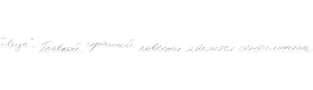 **GT:** Лиза". Главной героиней повести является сентименталь- | [**School Notebooks RU**](https://huggingface.co/datasets/ai-forever/school_notebooks_RU) 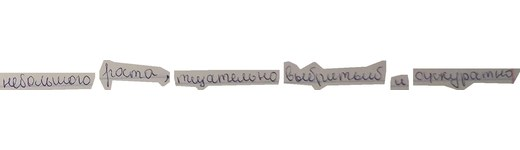 **GT:** небольшого роста, тщательно выбритый и аккуратно | [**Russian Old Orthography OCR**](https://huggingface.co/datasets/nevmenandr/russian-old-orthography-ocr) 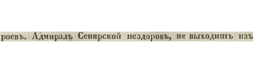 **GT:** роевъ. Адмиралъ Сенирской нездоровъ, не выходитъ изъ |
| --- | --- | --- | --- |
| **kraken_ppocrv6_medium** | Лиза». Главной чероиней повести являстся сентименталь¬ | небольшого роста, тщательно выбрятьй и аккуратно | роевъ. Адмиралъ Сенпрской нездоровъ, не выходитъ изъ |
| **cyrillic_large_handwritten** | Лица "Главной черенней волости является сентименталь- | небольшого роста, тщательно выбритый и аккуратно | роевъ. Адмиралъ Сентрской нездоровъ, не выходитъ изъ |
| **trocr_ru_1700s** | Лица Главной героиней повести является сентиментом | небольшого хроста, тщательно выбратьше и аккуратно, | роевъ. Адмираль Сенгрской нездоровъ, не выходитъ изъ |
| **kraken_ppocrv6_small** | Лща. Тлавкой чрашней ловеси авляетя сентилонталь¬ | небольшого роста, тщательно выбритьйи аккуратно | роевъ. Адмиралъ Сенпрской нездоровъ, не выходитъ изъ |
| **kraken_ppocrv6_tiny** | виуа.Гравкой черошней ровести двкяетчо сентиланталь- | небольшого роста, тцателно выбргитыи и сккуратна | роевъ. Адмиралъ Сенирской нездоровъ, ие выходитъ пзъ |
| **trocr_dialectic_stackmix** | Связа́-Главной черв'иной пов'ести является | небольшого фоста, тщательно выбратьиб'еаркуратно | роевъ. Адмираль-Сенарской нездоровъ, невыходишё-133 |
| **trba_lite_g1** | Каза Правой страний повести объекта летом | небольшого Чалазацительно Выбитыми о Выби | роевь. Адмираль Сенерской нездоровь, не в |
| **trocr_base_ru** | Лиза-Главной героиней-повести является | небольшого врата, тщательно,выбритьшегоаккуратно, | роевъ. Адмираль Сентрской-нездоровъ, невыходитъ |
| **trocr_dialectic** | Свеца́-Главной черв'иной повести является | небольшого фроста, тщательно-выбритый иаркуратно | роевъ. Адмираль-Сенарской нездоровъ,невыходишъ-133 |
| **trba_base_g1** | Евгерей Павкой гражениямительными | ниопольного распл, вщитальное выдительной | реевы. Адмираль Северской нездоров, не вы |
| **paddleocr_eslav_v5_mobile** | lуаTавно чероес ровеmu явеrs сеrрен | неsошorоpоmamyаmeоBбрumиsсyкураmu | роевь. Адмиралъ Сенирской нездоровъ, не выходипь изъ |
| **turkicocr_svtrv2_b** | Ануа — пабкы тэрдией. довети алгзетсо сентиивентать | нефоииою доста тцатешио быйитышл о очкуратик | роевь. Адмираль Сенирской нездоровы, не выходишь изы |
| **trocr_base_handwritten_ru** | Лез Гравой ирмый лестиявляется итностной | голимео рапо, пракаявабрильна додазажданания | проеп. Ип Сенрей нарды, не пополподить ить |
| **paddleocr_cyrillic_v5_mobile** | la Tabpor чepoe robemu aвrsere cerren | нeдошoopocmamyаmeко брumuscyкypamu | роевь. Адмираль Сенирской нездоровъ, не выходипь изъ |
| **cyrillic_g1** | З?ч. 71<8кос "ои{ {@бе77г(- 8=7& <2~{7<<<7т- | юабо %ост( > туатаикСышми* счччратио | роевъ. Адмиралъ Сенпрской нездоповъ, не выходишъ нзъ |
| **tesseract_cyrillic_best** | ∅ | ∅ | роевъ. Адмиралъ Сенирской нездоровъ, не выходитъ изъ |
| **cyrillic_g2** | '? " 74Жёжо7 "ео /4бе./2ч ~ 04_з&Я&+ (1 < 4с7+46 - | и0[0 (010 {{ъ_п 0 > [пъ %&ка [ъ0 [ъ $ т [Ч~&ра лил | роевъ: Адмиралъ Сенпрской нездоровъ; не выходипъ пзъ |
| **tesseract_rus_best** | беря. табиси ВДООНеНы девестаи, пиве сарардесмадрт | ∅ | роевъ. Адмиралъ Сенирской нездоровъ, не выходишЪ изЪ |
| **cyrillic_htr_model** | — | — | — |
