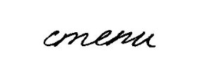
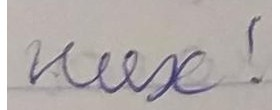
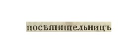

### Примеры предсказаний

| Модель | [**Handwritten Essay**](https://huggingface.co/datasets/sherstpasha/handwritten_essay)  **GT:** степи | [**School Notebooks RU**](https://huggingface.co/datasets/ai-forever/school_notebooks_RU)  **GT:** них! | [**Russian Old Orthography OCR**](https://huggingface.co/datasets/nevmenandr/russian-old-orthography-ocr)  **GT:** посѣтительницъ |
| --- | --- | --- | --- |
| **trba_base_g1** | степи | них! | посѣшительницъ |
| **trba_lite_g1** | степи | них! | посѣтишельницъ |
| **trocr_ru_1700s** | степи | них! | посѣтительницъ |
| **kraken_ppocrv6_medium** | сmeu | них! | посѣтиіпельницы |
| **cyrillic_large_handwritten** | степи | ниях. | посетительницъ |
| **trocr_dialectic_stackmix** | степи | них: | ПОСБТИПЕЛЬНИЦБ |
| **trocr_dialectic** | степи | них: | ПОСБЕПИТЕЛЬНИЦБ |
| **trocr_base_ru** | степи | них! | посыпительницы |
| **kraken_ppocrv6_small** | стeпи | тх! | посѣти пельниць |
| **trocr_base_handwritten_ru** | степи | них! | посытиплавныч |
| **cyrillic_htr_model** | степи | них. | посетительницъ |
| **kraken_ppocrv6_tiny** | cmenu | нх! | посѣтиіпельииць |
| **paddleocr_cyrillic_v5_mobile** | cmenu | vue! | посьпипельниць |
| **turkicocr_svtrv2_b** | стетии | кег і. | посьипельниць |
| **paddleocr_eslav_v5_mobile** | cmenu | nue! | посьпипельниць |
| **cyrillic_g2** | €<л2& | Илу < | посъпишпельницъ |
| **cyrillic_g1** | (ели | иуе ! | посъшилельниц |
| **tesseract_cyrillic_best** | СУТТЕ | ГСТУ | посътиштельни ць |
| **trocr_prereform_orthography** | Стева | ЛІЕСВА | посѣшишельницъ |
| **crnn_ctc_church_slavonic** | за¬ | . | посьтительницъ |
| **tesseract_rus_best** | Сидов | ∅ | посъпиищельниць |
